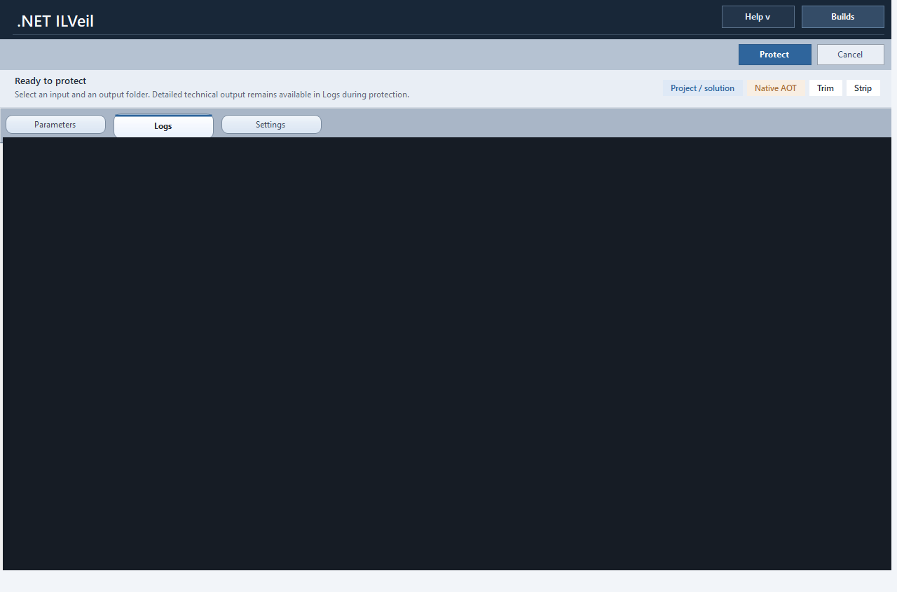

# ILVeil

Windows desktop `.NET obfuscator` and release protection workflow for managed assemblies, Native AOT publishing, activation management, and post-release diagnostics.

[Product Website](https://denis-rz.github.io/ILVeil-Releases/) | [Latest Release](https://github.com/Denis-RZ/ILVeil-Releases/releases/tag/v1.0.0) | [Download Windows x64 Build](./releases/ILVeil-win-x64-1.0.0.zip)

## Start Here

- Open the product site: [ILVeil Website](https://denis-rz.github.io/ILVeil-Releases/)
- Open the release page: [ILVeil v1.0.0](https://github.com/Denis-RZ/ILVeil-Releases/releases/tag/v1.0.0)
- Download the portable package: [ILVeil-win-x64-1.0.0.zip](./releases/ILVeil-win-x64-1.0.0.zip)
- Verify integrity: [SHA256SUMS.txt](./releases/SHA256SUMS.txt)

## What This Public Repository Contains

This repository is intentionally limited to:

- signed release binaries and portable packages
- screenshots and product documentation
- landing-page content for GitHub Pages
- release notes and checksums

It does **not** contain the private source code repository.

## Product Highlights

- managed assembly protection for compiled `.NET` applications
- Native AOT publish workflow
- custom IL layer with compatibility-aware preservation logic
- rename-map output and support-oriented release diagnostics
- activation and edition management inside the desktop UI

## Target Use Cases

- protect compiled `.NET` desktop applications before release
- run a GUI-driven `.NET obfuscation` workflow on Windows
- prepare `Native AOT` outputs and keep operational diagnostics usable
- manage protection settings, activation, and builds from one desktop interface

## Screenshots

## Pro Licensing

For commercial Pro licensing or evaluation requests, contact [dengwebdev@gmail.com](mailto:dengwebdev@gmail.com).
