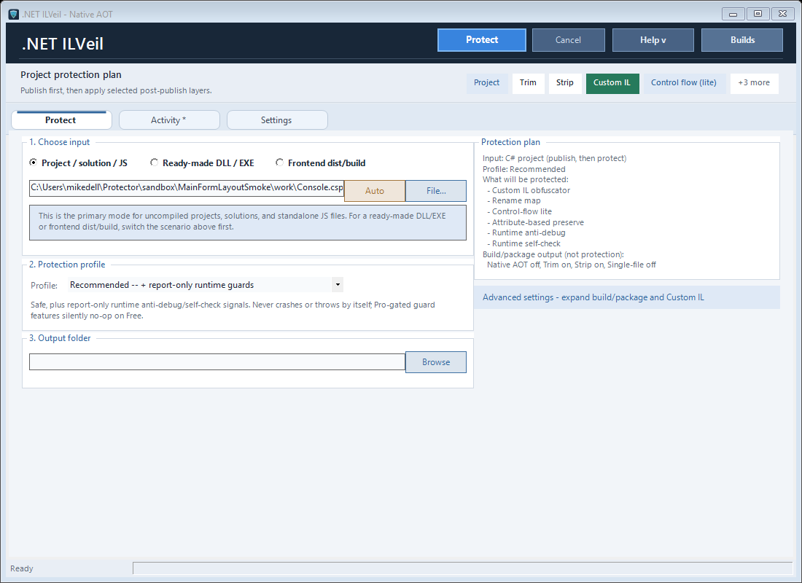
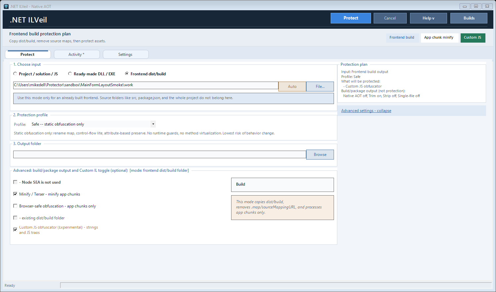
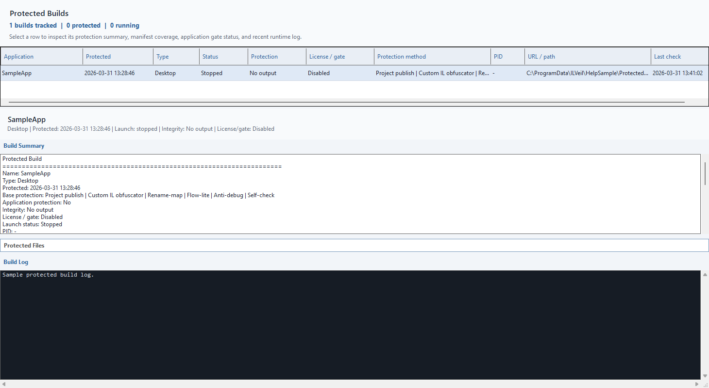

# ILVeil

Public release repository for the `ILVeil` desktop application.

ILVeil is a Windows desktop `.NET obfuscator` and `.NET protection` tool focused on managed assembly protection, Native AOT publishing workflows, and operator-friendly release operations.

This repository is intentionally limited to:

- signed release binaries and portable packages
- screenshots and product documentation
- landing-page content for GitHub Pages

It does not contain the private source code repository.

## Download

- Portable package: [ILVeil-win-x64-1.0.0.zip](./releases/ILVeil-win-x64-1.0.0.zip)
- SHA-256: [SHA256SUMS.txt](./releases/SHA256SUMS.txt)

## Product Highlights

- compatibility-aware managed protection for compiled .NET assemblies
- Native AOT publish flow
- Custom IL layer with string encryption, safe rename, and rename-map output
- activation and edition management built into the desktop UI

## Target Use Cases

- protect compiled `.NET` desktop applications before release
- run a GUI-driven `.NET obfuscation` workflow on Windows
- prepare `Native AOT` outputs and keep operational diagnostics usable
- manage protection settings, activation, and builds from one desktop interface

## Screenshots

## Pro Licensing

For commercial Pro licensing or evaluation requests, contact `dengwebdev@gmail.com`.
