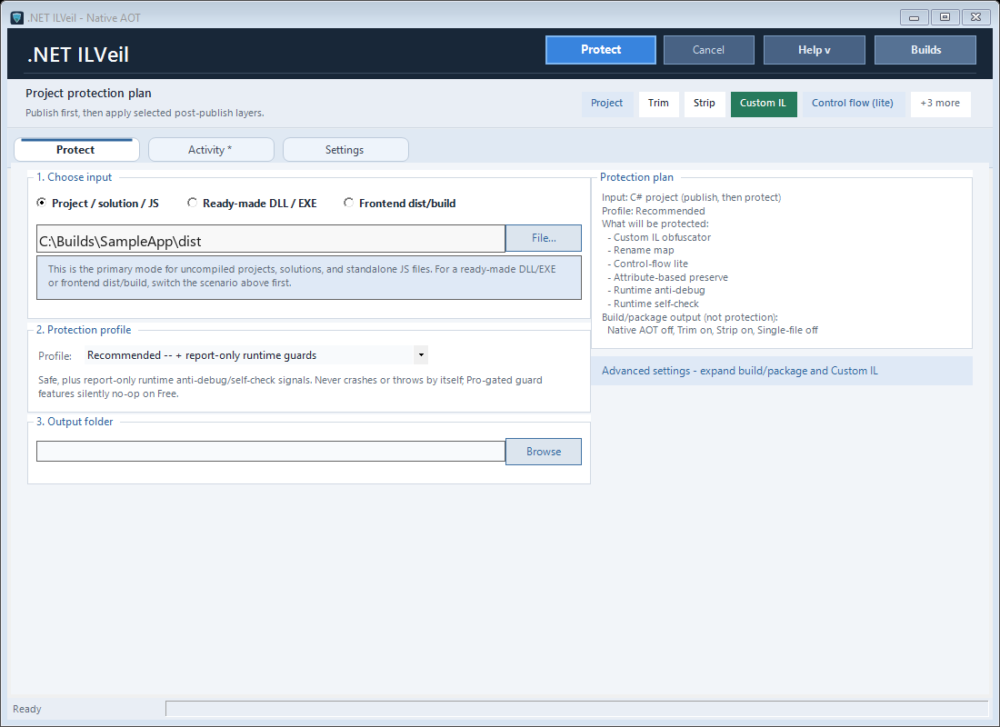
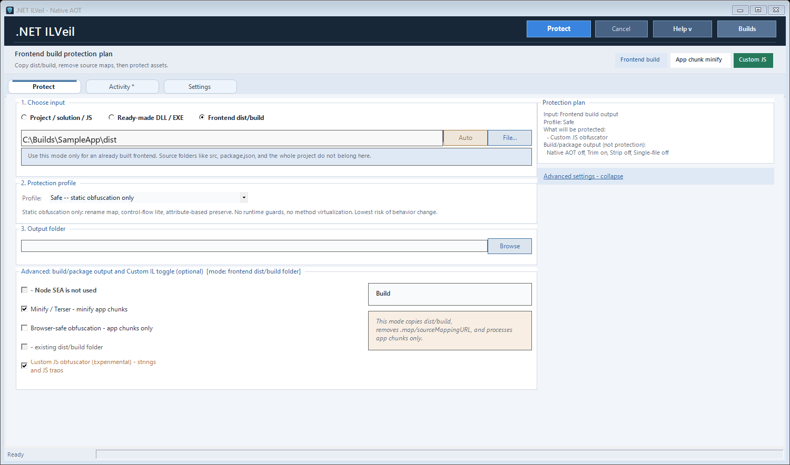
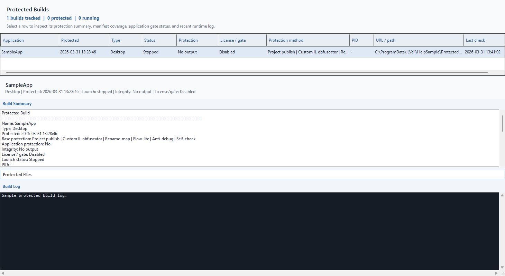
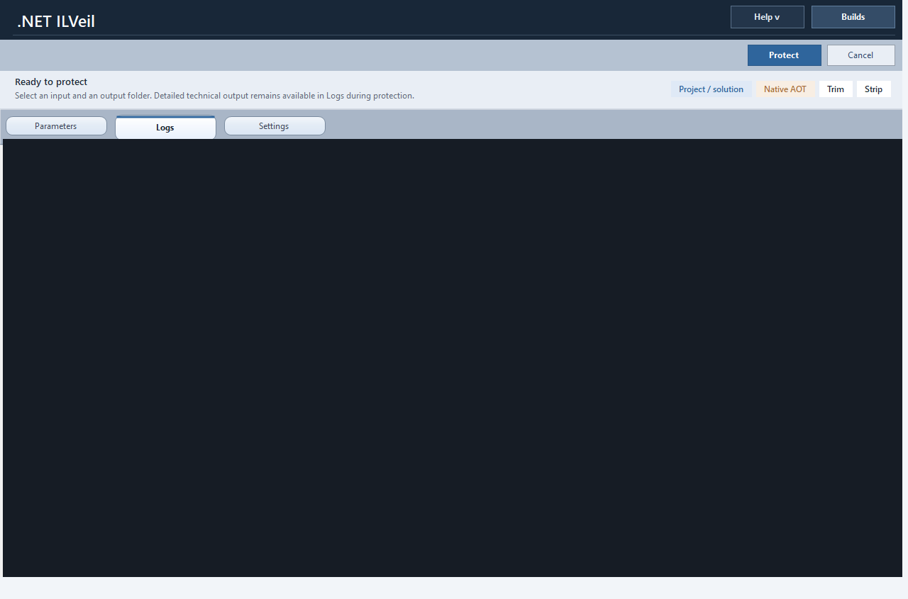

# ILVeil

Windows desktop `.NET obfuscator` and release protection workflow for managed assemblies, Native AOT publishing, activation management, and post-release diagnostics.

[Product Website](https://denis-rz.github.io/ILVeil-Releases/) | [Crackme Demo](https://denis-rz.github.io/ILVeil-Releases/crackme.html)

## Start Here

- Open the product site: [ILVeil Website](https://denis-rz.github.io/ILVeil-Releases/)
- Try the protected Windows Crackme: [ILVeil Crackme Demo](https://denis-rz.github.io/ILVeil-Releases/crackme.html)
- Evaluation builds of the protector are provided after an initial technical discussion.
- Verify integrity: [SHA256SUMS.txt](./releases/SHA256SUMS.txt)
- Try the protected V2 crackme demo: [ILVeil-Crackme-V2.zip](./releases/ILVeil-Crackme-V2.zip)

## What This Public Repository Contains

This repository is intentionally limited to:

- signed release binaries and portable packages
- screenshots and product documentation
- landing-page content for GitHub Pages
- release notes and checksums

It does **not** contain the private source code repository.

## Product Highlights

- managed assembly protection for compiled `.NET` applications
- Native AOT publish workflow
- custom IL layer with compatibility-aware preservation logic
- rename-map output and support-oriented release diagnostics
- activation and edition management inside the desktop UI
- expanded VM return-shape, instance-operation, switch, and auto-selection coverage
- Native VM Runtime Variant with deployment-bound key material and Capability Gate V2
- CLI support for self-contained Runtime Variant protection
- optional Application Guard SDK for signed capabilities, derived values, flow checkpoints, and encrypted resources
- bundled Application License Issuer and SDK integration examples

## Target Use Cases

- protect compiled `.NET` desktop applications before release
- run a GUI-driven `.NET obfuscation` workflow on Windows
- prepare `Native AOT` outputs and keep operational diagnostics usable
- manage protection settings, activation, and builds from one desktop interface
- protect licensing logic, proprietary algorithms, desktop software, game clients, and Native AOT releases

## Screenshots

## Pro Licensing

For commercial Pro licensing or evaluation requests, contact [dengwebdev@gmail.com](mailto:dengwebdev@gmail.com).
